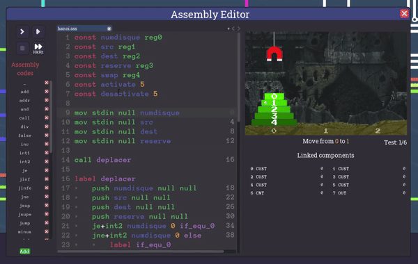
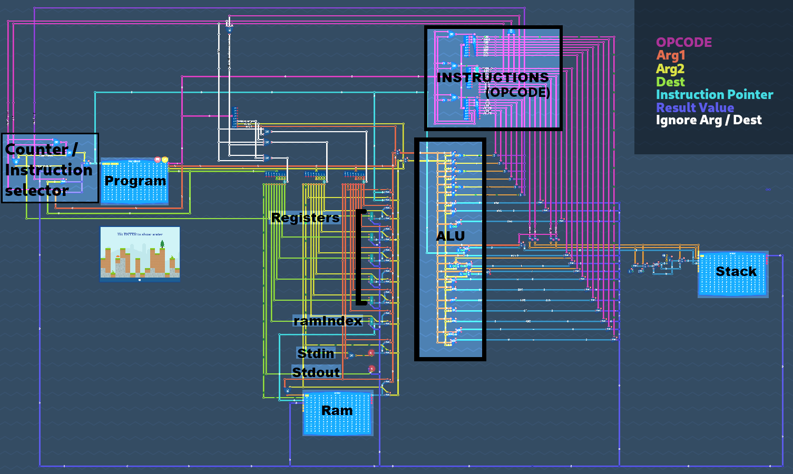
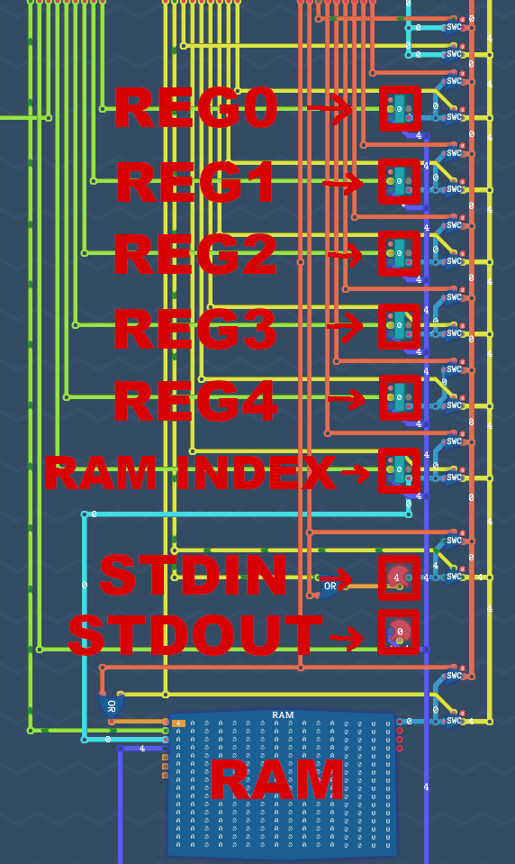
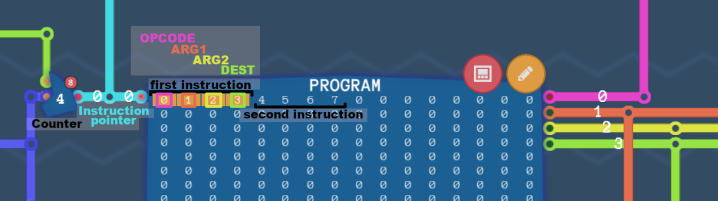
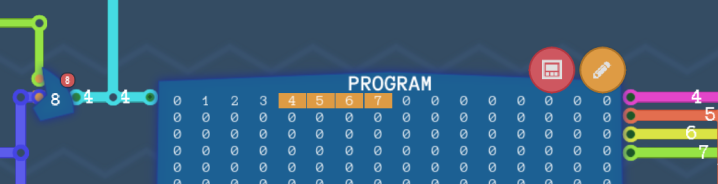
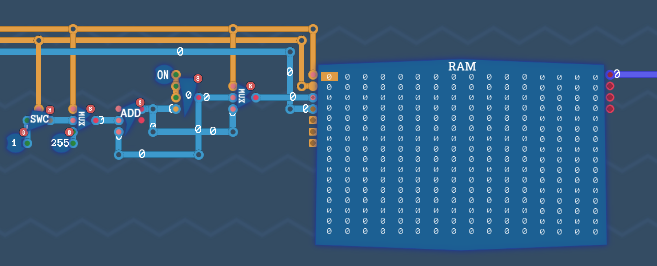
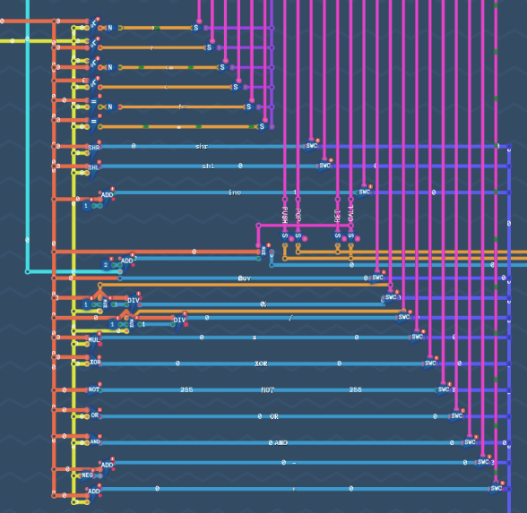
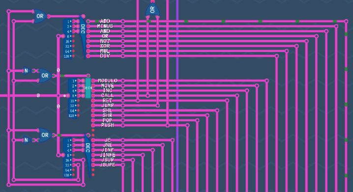
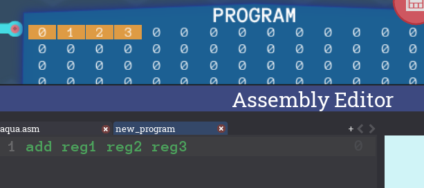
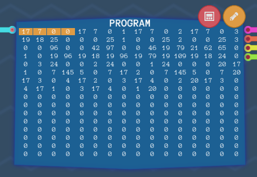

# Nand2Computer
My own computer architecture and assembly language.





## About this project

[Turing complete](https://turingcomplete.game) is an educational game focused on computer science. You begin with NAND gates and progressively build other gates like OR, AND, NOT, XOR, etc. Eventually, you create components and, ultimately, a Turing complete architecture with its own assembly language.
I am curently ranked [251/85k](https://turingcomplete.game/leaderboard) on the leaderboard of Turing complete. [My turing complete profile](https://turingcomplete.game/profile/101858).

The turing complete trailer:

[](https://www.youtube.com/watch?v=-YY73ejihZo)

## Table of Contents

1. [My architecture](#my-architecture)
   - [Memory](#memory)
   - [Program](#program)
   - [Stack](#stack)
   - [Arithmetic logic unit (ALU)](#arithmetic-logic-unit-alu)
   - [Operation codes (opcode)](#operation-codes-opcode)
2. [My assembly](#my-assembly)
   - [Instructions](#instructions)
   - [Opcodes](#opcodes)
   - [Details on how functions calls operates](#details-on-how-functions-calls-operates)
   - [Source / Destination](#source--destination)
   - [Additional assembly keyword](#additional-assembly-keyword)
3. [Solving Tower of Hanoi](#solving-tower-of-hanoi)
   - [Assembly code](#assembly-code)
   - [Decimal code in memory](#decimal-code-in-memory)

## My architecture


### Memory

Each registers, the ramIndex register, the input / output components can take a value from 0 to 255 (uint8). The program memory area, the ram and the stack can take 256 values that range from 0 to 255.




### Program

Each cycle, the counter add 4 to the instruction pointer so that the computer can execute the next instruction. The value of the instruction pointer can be forced with a jump, jne, je, jsup, jsupe, jinf or jinfe instruction.



The next cycle:



### Stack
It is possible to fill the stack using the `push` instruction and to empty it using the `pop` instruction. The stack is used to save the instruction pointer during a function `call`.



### Arithmetic logic unit (ALU)
The arithmetic logic unit (ALU) is a combinational digital circuit that performs arithmetic and bitwise operations on integer binary numbers. The inputs to an ALU are the data to be operated on, called operands, and a code indicating the operation to be performed; the ALU's output is the result of the performed operation. 



### Operation codes (opcode)


## My assembly

### Instructions

An instruction is divided into up to four distinct parts, each encoded with one byte (uint8 ranging from 0 to 255):
```asm
Opcode <arg1> <arg2> <dest>
```
example :
```asm
0 1 2 3
```
0 corresponds to the instruction `add`\
1 corresponds to `reg1`\
2 corresponds to `reg2`\
3 corresponds to `reg3`\
So the instruction `0 1 2 3` means `reg3 = reg1 + reg2`

To simplify programming, the compiler will recognize a list of keywords and replace them with their corresponding values. So we will be able to write :

```asm
add reg1 reg2 reg3
```
This instruction in the game text editor and its decimal value in memory :


### Opcodes

The complete list of opcodes :

| Opcode | Binary | Assembly | Instruction |
|---|---|---|---|
| 0 | xx00 0000 | add \<arg1> \<arg2> \<dest> | dest = arg1 + arg2 |
| 1 | xx00 0001 | minus \<arg1> \<arg2> \<dest> | dest = arg1 - arg2 |
| 2 | xx00 0010 | and \<arg1> \<arg2> \<dest> | dest = arg1 & arg2 |
| 3 | xx00 0011 | or \<arg1> \<arg2> \<dest> | dest = arg1 \| arg2 |
| 4 | xx00 0100 | not \<arg1> \<ignored> \<dest> | dest = !arg1 |
| 5 | xx00 0101 | xor \<arg1> \<arg2> \<dest> | dest = arg1 ^ arg2 |
| 6 | xx00 0110 | multiply \<arg1> \<arg2> \<dest> | dest = arg1 * arg2 |
| 7 | xx00 0111 | div \<arg1> \<arg2> \<dest> | dest = arg1 / arg2 |
| 16 | xx01 0000 | modulo \<arg1> \<arg2> \<dest> | dest = arg1 % arg2 |
| 17 | xx01 0001 | mov \<arg1> \<ignored> \<dest> | dest = arg1 |
| 18 | xx01 0010 | inc \<arg1> \<ignored> \<dest> | dest = arg1 + 1 |
| 19 | xx01 0011 | call \<function> | function() |
| 20 | xx01 0100 | ret | return |
| 21 | xx01 0101 | jump \<address> | jump(address) |
| 22 | xx01 0110 | shl \<arg1> \<arg2> \<dest> | dest = arg1 << arg2 |
| 23 | xx01 0111 | shr \<arg1> \<arg2> \<dest> | dest = arg1 >> arg2 |
| 24 | xx01 1000 | pop \<ignored> \<ignored> \<dest> | dest = pop(), pop the stack into dest |
| 25 | xx01 1001 | push \<arg1> | push arg1 in the stack|
| 32 | xx10 0000 | je \<arg1> \<arg2> \<address> | if ( arg1 == arg2) { jump(address) } |
| 33 | xx10 0001 | jne \<arg1> \<arg2> \<address> | if ( arg1 != arg2) { jump(address) } |
| 34 | xx10 0010 | jinf \<arg1> \<arg2> \<address> | if (arg1 < arg2) { jump(address) } |
| 35 | xx10 0011 | jinfe \<arg1> \<arg2> \<address> | if (arg1 <= arg2) { jump(address) } |
| 36 | xx10 0100 | jsup \<arg1> \<arg2> \<address> | if (arg1 > arg2) { jump(address) } |
| 37 | xx10 0101 | jsupe \<arg1> \<arg2> \<address> | if (arg1 >= arg2) { jump(address) } |


The first two bits of the opcode indicate whether `<arg1>` and `<arg2>` are:
 - Literal values (uint8) if encoded with 1 
- Codes for a register, input, output, or RAM if encoded with 0

| Opcode | arg1 | arg2 |
|---|---|---|
|00xx xxxx| memory code | memory code |
|01xx xxxx| memory code | uint8 value|
|10xx xxxx| uint8 value| memory code|
|11xx xxxx| uint8 value| uint8 value|

To modify the first two bits we will use `int1` and `int2` asssembly keyword

| binary | asm |
|---|---|
|1000 0000| int1 |
|0100 0000| int2 |

So to add 1 and 2 into reg0, the correct instruction is :
```asm
add+int1+int2 1 2 reg0
``` 

### Details on how functions calls operates:

special instruction | details
---|---
`call <function>` | `push` in the stack the value of the current instruction pointer and `jump` to the address of the function
`ret` | `pop` the value of the instruction pointer when the function was called and jump to the next instruction

### Source / Destination
There are 9 different sources or destinations possible :
| Code | Binary | Assembly | Source / Destination |
|---|---|---|---|
| 0 | 0000 0000 | reg0 | register 0 |
| 1 | 0000 0001 | reg1 | register 1 |
| 2 | 0000 0010 | reg2 | register 2 |
| 3 | 0000 0011 | reg3 | register 3 |
| 4 | 0000 0100 | reg4 | register 4 |
| 5 | 0000 0101 | ramIndex | index of ram |
| 6 | 0000 0110 | addr | instruction pointer |
| 7 | 0000 0111 | stdin / stdout | input / output |
| 8 | 0000 1000 | ram | ram[ramIndex] |

<details>

</details>

### Additional assembly keyword

Assembly keyword | Value | Usage
---|---|---
null | 0 | ignored argument
false | 0 | boolean
true | 1 | boolean


## Solving Tower of Hanoi

#### Thanks to my computer, I can solve the tower of hanoi problem :

The first 4 inputs will give you the following in order :
- disk_nr - The highest disk number in the pile (2 to 4)
- source - Which location number to move from
- destination - Where to move the pile to
- spare - the 3rd spot that is neither the source nor the destination


Control the crane with the followin outputs : 
- 0 - Move the magnet to spot 0
- 1 - Move the magnet to spot 1
- 2 - Move the magnet to spot 2
- 5 - Toggle the magnet on or off


### Assembly code

You can find bellow the complete assembly code. I used two syntactic sugar `const` and `label`.

```asm
const numdisque reg0
const src reg1
const dest reg2
const reserve reg3
const swap reg4
const activate 5
const desactivate 5

mov stdin null numdisque
mov stdin null src
mov stdin null dest
mov stdin null reserve

call deplacer 

label deplacer
    push numdisque null null
    push src null null
    push dest null null
    push reserve null null
    je+int2 numdisque 0 if_equ_0
    jne+int2 numdisque 0 else
        label if_equ_0
        call move_disk
    jump endif
    label else
        minus+int2 numdisque 1 numdisque
        call swap_dest_reserve
        call deplacer
        call swap_dest_reserve
        call move_disk
        call swap_reserve_source
        call deplacer
    label endif
    
    pop null null reserve
    pop null null dest
    pop null null src
    pop null null numdisque
ret

label move_disk
    mov src null stdout
    mov+int1 activate null stdout
    mov dest null stdout
    mov+int1 desactivate null stdout
ret

label swap_dest_reserve
    mov reserve null swap
    mov dest null reserve
    mov swap null dest
ret

label swap_reserve_source
    mov reserve null swap
    mov src null reserve
    mov swap null src
ret
```

### Decimal code in memory
The exact same code in decimal: 

